# Бинаризация
  
Выполнил Ахманов Алексей Б18-514
## cat.png

### Исходная картинка
  
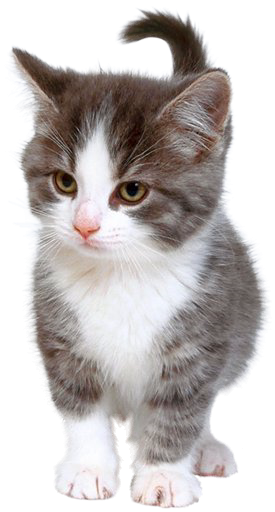
### Интерполяция с коэффициентом 3
  

### Децимация с коэффициентом 4
  

### Двухпроходная передескритизация с коэффициентом 3/4
  

### Однопроходная передескритизация с коэффициентом 3/4
  

### Оттенки серого
  
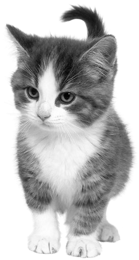
### Оттенки серого (как в Photoshop)
  

### Бинаризация (балансировка гистограммы)
  
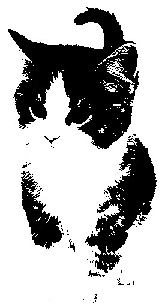
## colors.jpg

### Исходная картинка
  
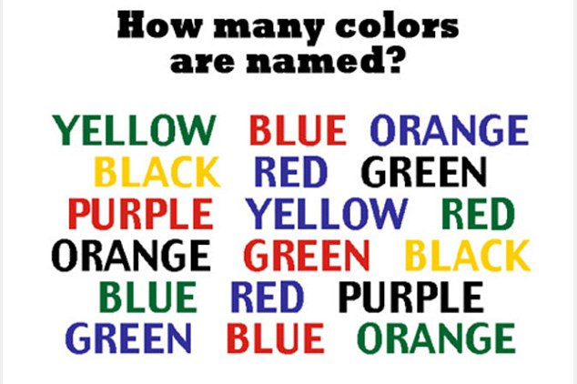
### Интерполяция с коэффициентом 3
  
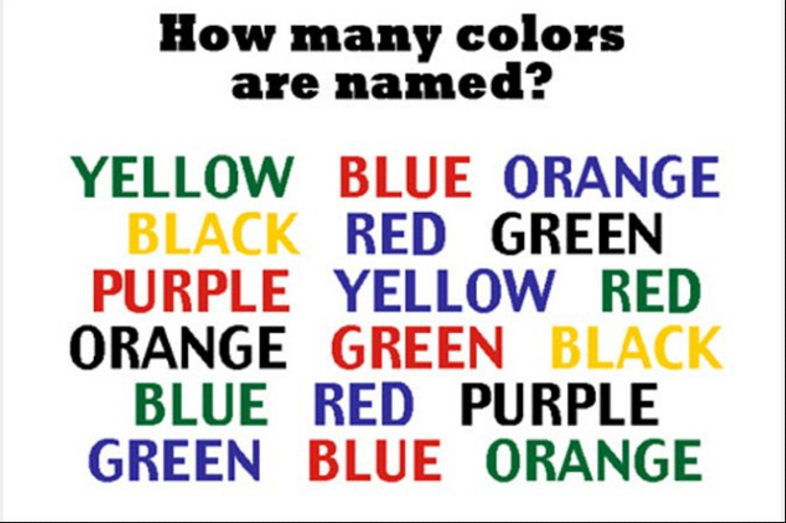
### Децимация с коэффициентом 4
  
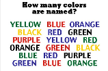
### Двухпроходная передескритизация с коэффициентом 3/4
  
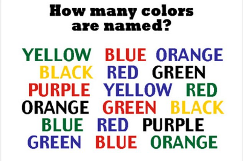
### Однопроходная передескритизация с коэффициентом 3/4
  

### Оттенки серого
  
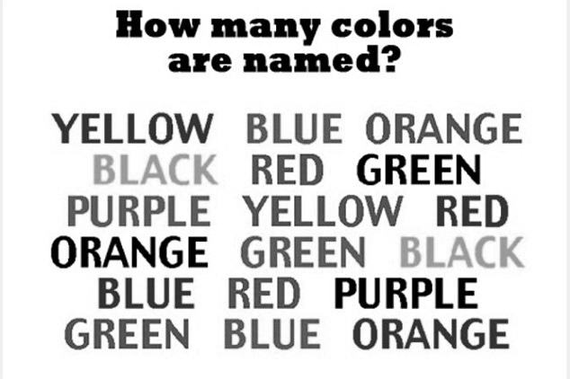
### Оттенки серого (как в Photoshop)
  
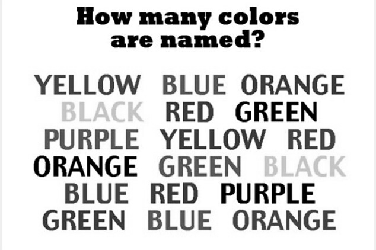
### Бинаризация (балансировка гистограммы)
  
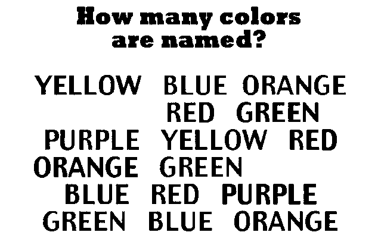
## cool.jpg

### Исходная картинка
  
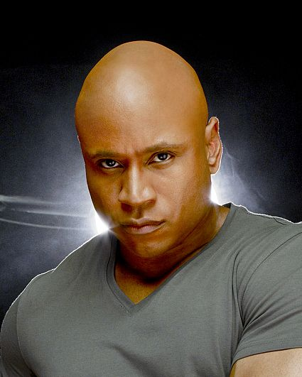
### Интерполяция с коэффициентом 3
  

### Децимация с коэффициентом 4
  

### Двухпроходная передескритизация с коэффициентом 3/4
  

### Однопроходная передескритизация с коэффициентом 3/4
  

### Оттенки серого
  
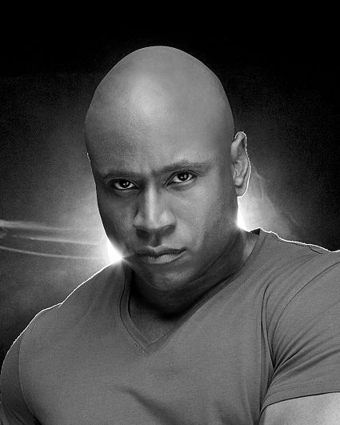
### Оттенки серого (как в Photoshop)
  
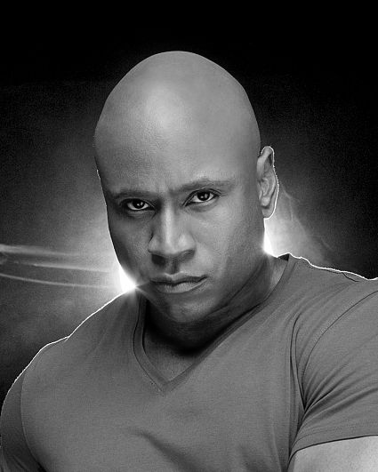
### Бинаризация (балансировка гистограммы)
  
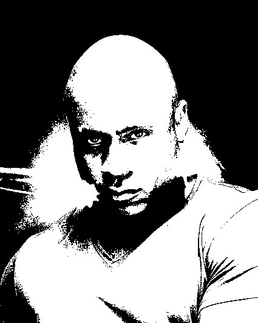