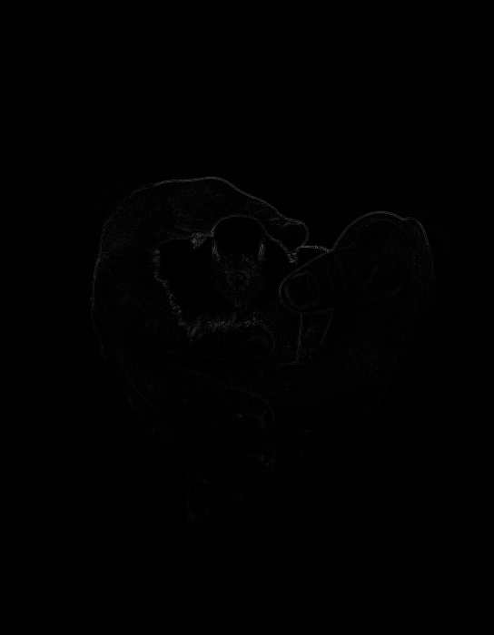
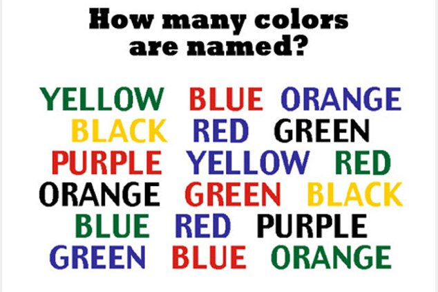
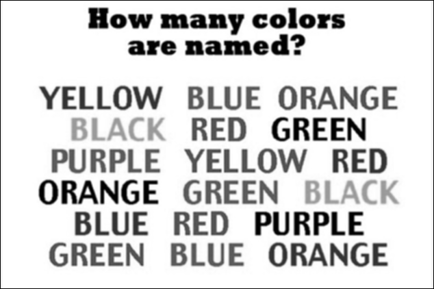
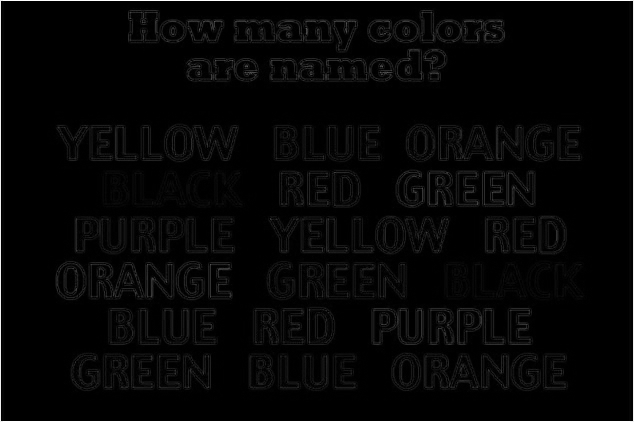
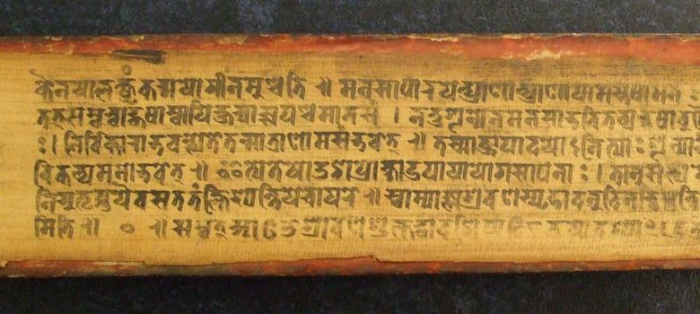
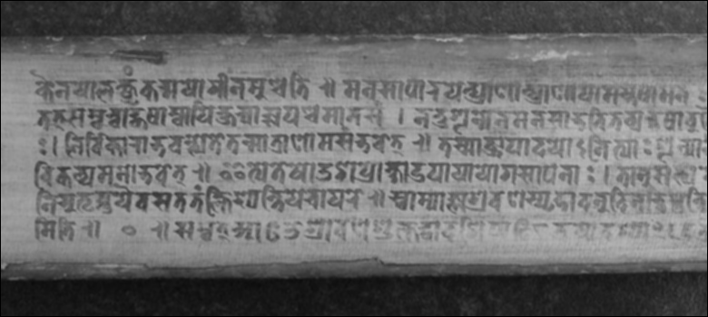
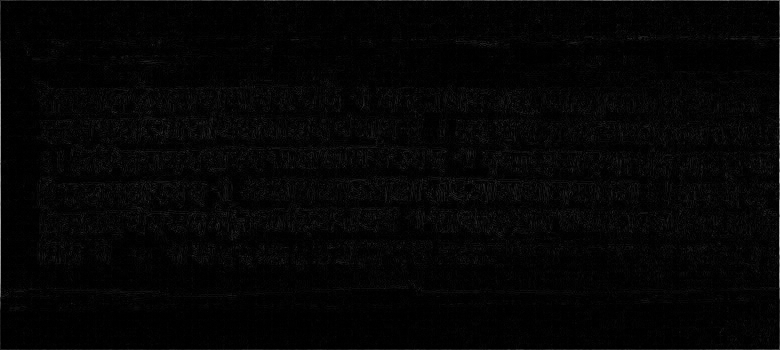

# Фильтры и морфология
  
Выполнил Ахманов Алексей Б18-514
## monah.jpg

### Исходная картинка
  

### Пространственное сглаживание
  

### Разница сглаженной и исходной
  

## colors.jpg

### Исходная картинка
  

### Пространственное сглаживание
  

### Разница сглаженной и исходной
  

## old_text_2.jpg

### Исходная картинка
  

### Пространственное сглаживание
  

### Разница сглаженной и исходной
  
