# Выделение признаков символов
  
Выполнил Ахманов Алексей Б18-514  
Алфавит - AΒΓΔΕΖΗΘΙΚΛΜΝΞΟΠΡΣΤΥΦΧΨΩ
## Буква A
  
  
Вес черного - 990  
Удельный вес черного - 0.7869634340222575  
Координаты центра масс - (18, 16)  
Нормированные координаты центра масс - (0.4722222222222222, 0.45454545454545453)  
Центральный горизонтальный осевой момент - 95066  
Центральный вертикальный осевой момент - 126428  
Нормированный центральный горизонтальный осевой момент -37.64990099009901  
Нормированный центральный вертикальный осевой момент -50.07049504950495  
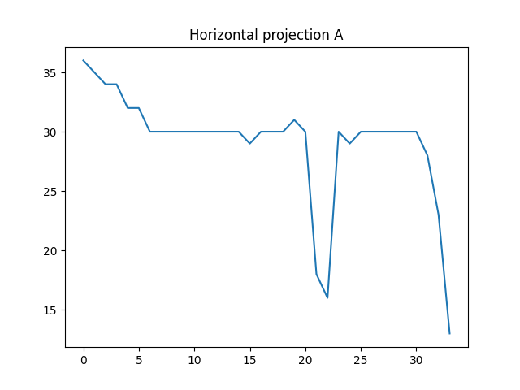  
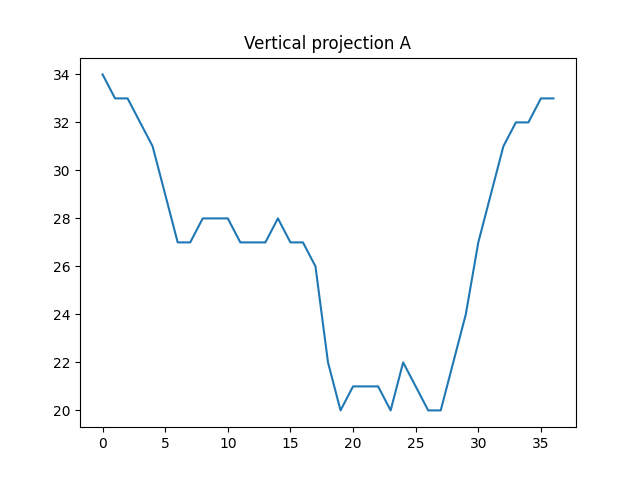  

## Буква Β
  
  
Вес черного - 659  
Удельный вес черного - 0.6056985294117647  
Координаты центра масс - (15, 16)  
Нормированные координаты центра масс - (0.45161290322580644, 0.45454545454545453)  
Центральный горизонтальный осевой момент - 57755  
Центральный вертикальный осевой момент - 59088  
Нормированный центральный горизонтальный осевой момент -26.493119266055047  
Нормированный центральный вертикальный осевой момент -27.1045871559633  
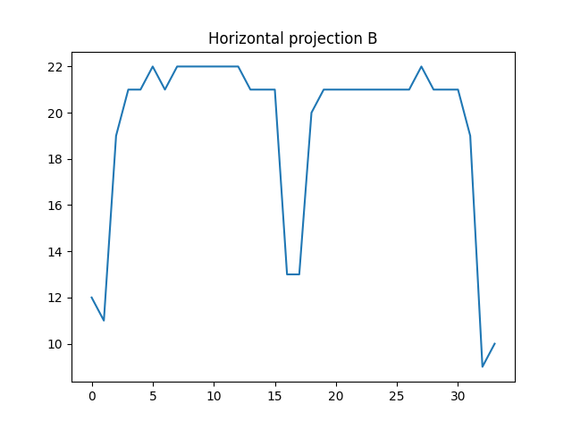  
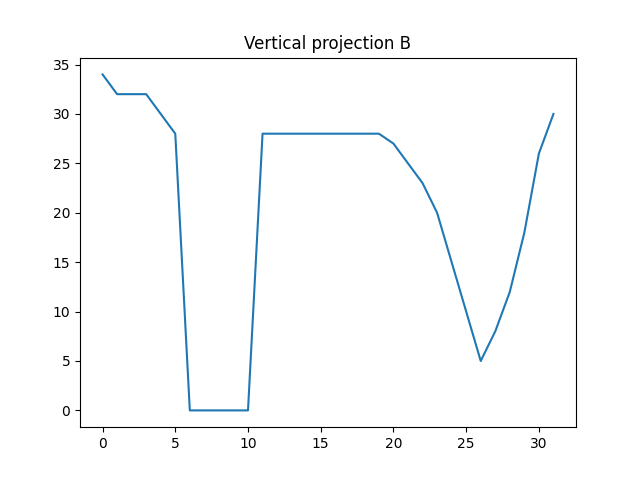  

## Буква Γ
  
  
Вес черного - 748  
Удельный вес черного - 0.7586206896551724  
Координаты центра масс - (15, 17)  
Нормированные координаты центра масс - (0.5, 0.48484848484848486)  
Центральный горизонтальный осевой момент - 61756  
Центральный вертикальный осевой момент - 56065  
Нормированный центральный горизонтальный осевой момент -30.924386579869804  
Нормированный центральный вертикальный осевой момент -28.074611917876815  
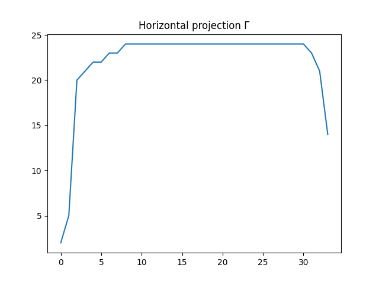  
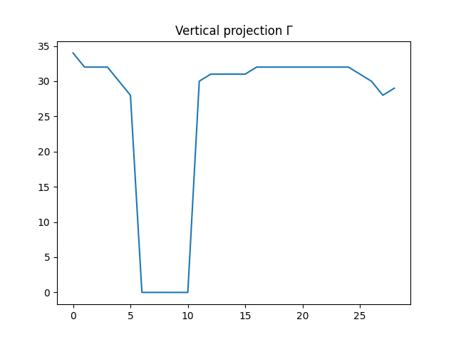  

## Буква Δ
  
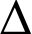  
Вес черного - 824  
Удельный вес черного - 0.7573529411764706  
Координаты центра масс - (15, 15)  
Нормированные координаты центра масс - (0.45161290322580644, 0.42424242424242425)  
Центральный горизонтальный осевой момент - 73547  
Центральный вертикальный осевой момент - 77633  
Нормированный центральный горизонтальный осевой момент -33.737155963302754  
Нормированный центральный вертикальный осевой момент -35.611467889908255  
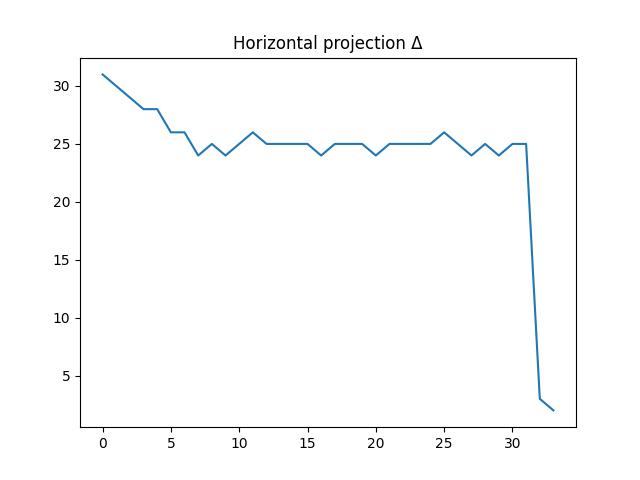  
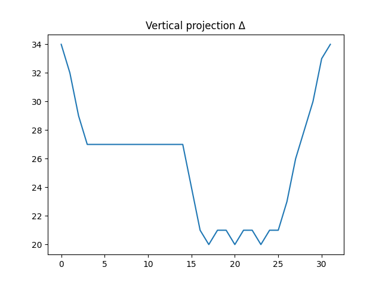  

## Буква Ε
  
  
Вес черного - 700  
Удельный вес черного - 0.6862745098039216  
Координаты центра масс - (16, 17)  
Нормированные координаты центра масс - (0.5172413793103449, 0.48484848484848486)  
Центральный горизонтальный осевой момент - 57138  
Центральный вертикальный осевой момент - 56863  
Нормированный центральный горизонтальный осевой момент -27.790856031128406  
Нормированный центральный вертикальный осевой момент -27.657101167315176  
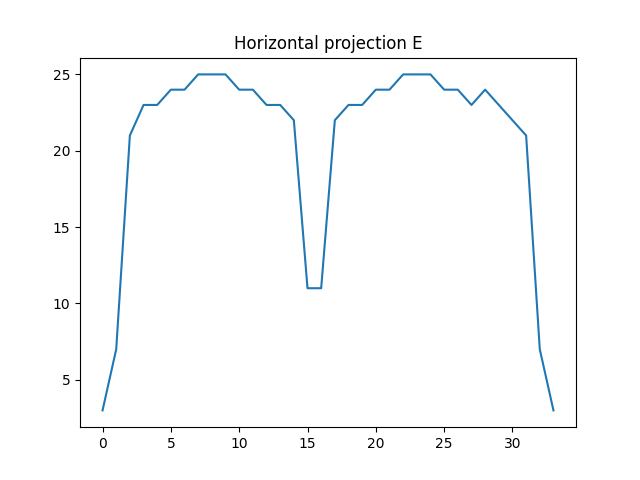  
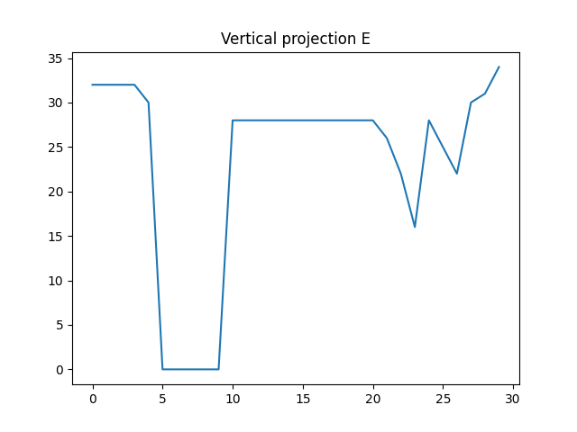  

## Буква Ζ
  
  
Вес черного - 757  
Удельный вес черного - 0.7182163187855788  
Координаты центра масс - (15, 16)  
Нормированные координаты центра масс - (0.4666666666666667, 0.45454545454545453)  
Центральный горизонтальный осевой момент - 57855  
Центральный вертикальный осевой момент - 67967  
Нормированный центральный горизонтальный осевой момент -27.328767123287673  
Нормированный центральный вертикальный осевой момент -32.10533774208786  
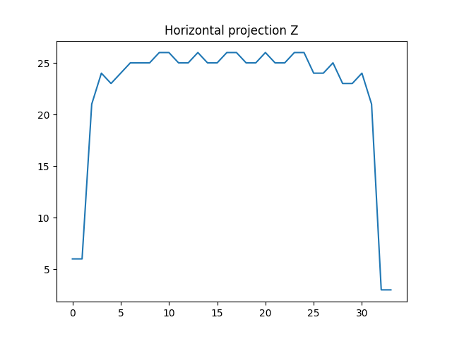  
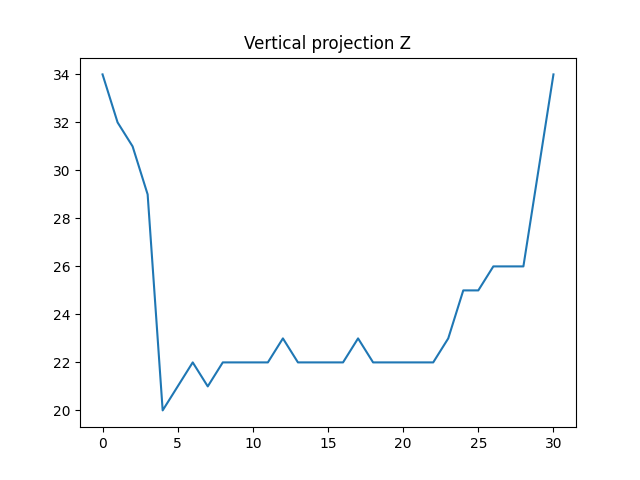  

## Буква Η
  
  
Вес черного - 857  
Удельный вес черного - 0.6812400635930048  
Координаты центра масс - (18, 16)  
Нормированные координаты центра масс - (0.4722222222222222, 0.45454545454545453)  
Центральный горизонтальный осевой момент - 75788  
Центральный вертикальный осевой момент - 101935  
Нормированный центральный горизонтальный осевой момент -30.015049504950493  
Нормированный центральный вертикальный осевой момент -40.37029702970297  
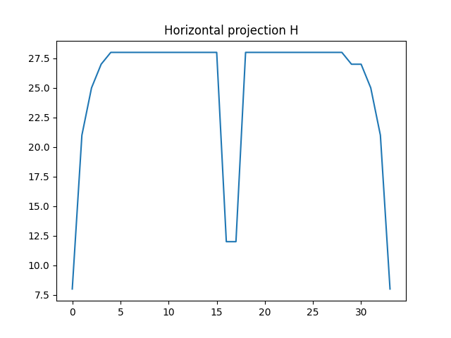  
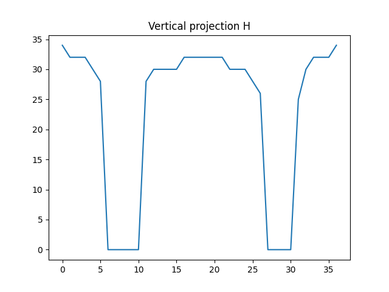  

## Буква Θ
  
  
Вес черного - 772  
Удельный вес черного - 0.6487394957983194  
Координаты центра масс - (17, 17)  
Нормированные координаты центра масс - (0.47058823529411764, 0.48484848484848486)  
Центральный горизонтальный осевой момент - 82118  
Центральный вертикальный осевой момент - 74351  
Нормированный центральный горизонтальный осевой момент -34.48887022259555  
Нормированный центральный вертикальный осевой момент -31.226795464090717  
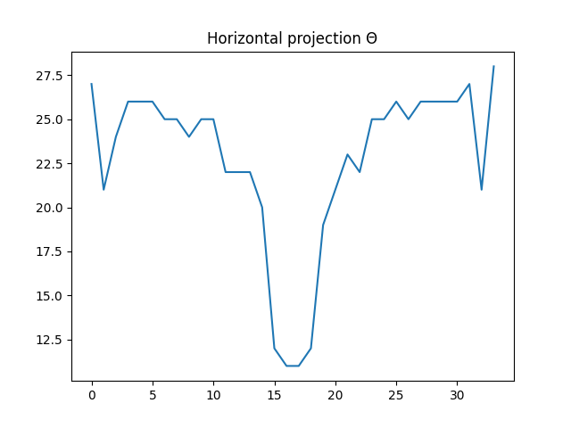  
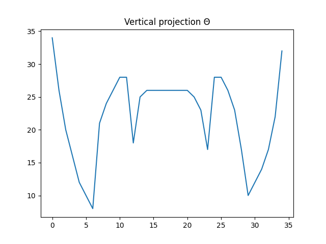  

## Буква Ι
  
  
Вес черного - 348  
Удельный вес черного - 0.6397058823529411  
Координаты центра масс - (8, 16)  
Нормированные координаты центра масс - (0.4666666666666667, 0.45454545454545453)  
Центральный горизонтальный осевой момент - 29227  
Центральный вертикальный осевой момент - 10573  
Нормированный центральный горизонтальный осевой момент -20.69900849858357  
Нормированный центральный вертикальный осевой момент -7.487960339943343  
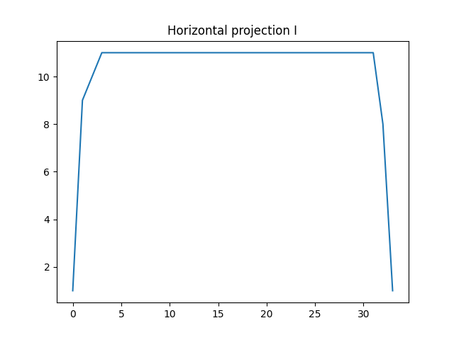  
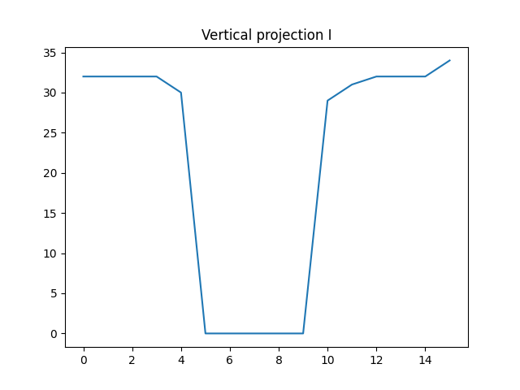  

## Буква Κ
  
  
Вес черного - 896  
Удельный вес черного - 0.6934984520123839  
Координаты центра масс - (20, 16)  
Нормированные координаты центра масс - (0.5135135135135135, 0.45454545454545453)  
Центральный горизонтальный осевой момент - 77383  
Центральный вертикальный осевой момент - 120972  
Нормированный центральный горизонтальный осевой момент -29.76269230769231  
Нормированный центральный вертикальный осевой момент -46.527692307692305  
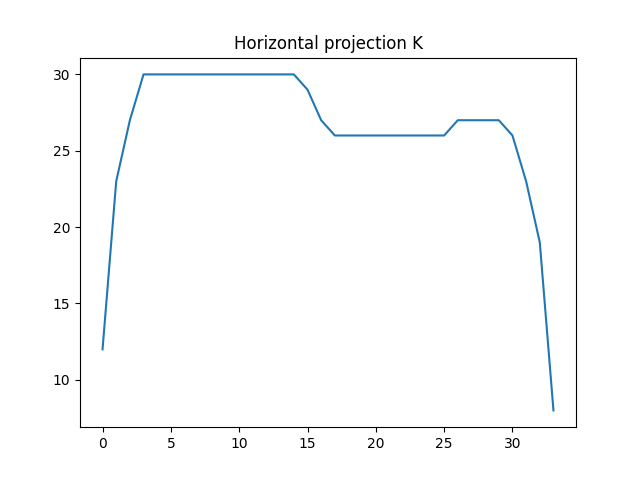  
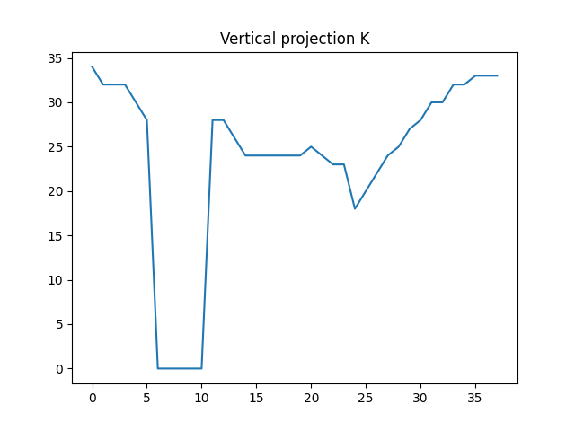  

## Буква Λ
  
  
Вес черного - 1043  
Удельный вес черного - 0.8072755417956656  
Координаты центра масс - (18, 16)  
Нормированные координаты центра масс - (0.4594594594594595, 0.45454545454545453)  
Центральный горизонтальный осевой момент - 98176  
Центральный вертикальный осевой момент - 138449  
Нормированный центральный горизонтальный осевой момент -37.76  
Нормированный центральный вертикальный осевой момент -53.24961538461538  
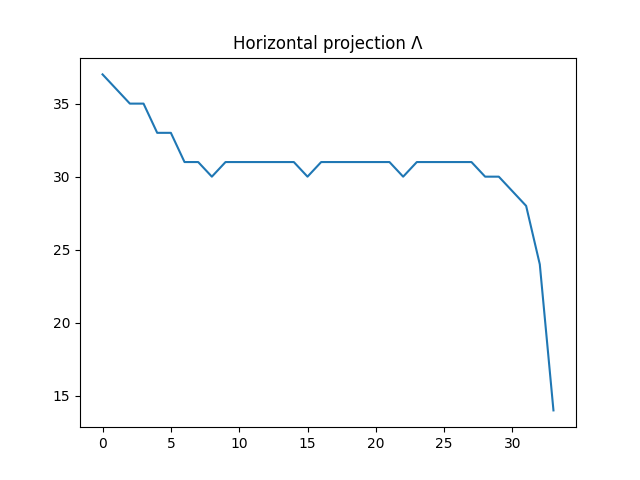  
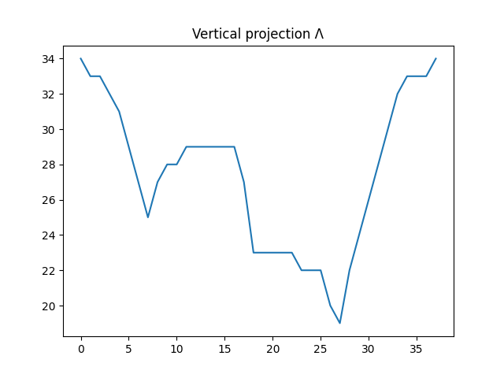  

## Буква Μ
  
  
Вес черного - 1073  
Удельный вес черного - 0.6860613810741688  
Координаты центра масс - (22, 16)  
Нормированные координаты центра масс - (0.4666666666666667, 0.45454545454545453)  
Центральный горизонтальный осевой момент - 101196  
Центральный вертикальный осевой момент - 195308  
Нормированный центральный горизонтальный осевой момент -30.9278728606357  
Нормированный центральный вертикальный осевой момент -59.69070904645477  
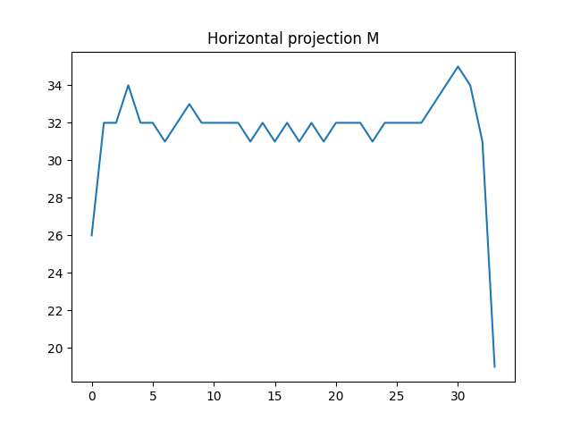  
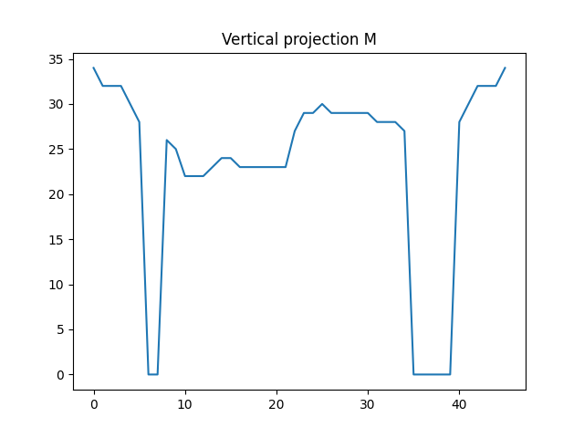  

## Буква Ν
  
  
Вес черного - 927  
Удельный вес черного - 0.7368839427662957  
Координаты центра масс - (18, 17)  
Нормированные координаты центра масс - (0.4722222222222222, 0.48484848484848486)  
Центральный горизонтальный осевой момент - 88017  
Центральный вертикальный осевой момент - 110802  
Нормированный центральный горизонтальный осевой момент -34.858217821782176  
Нормированный центральный вертикальный осевой момент -43.881980198019804  
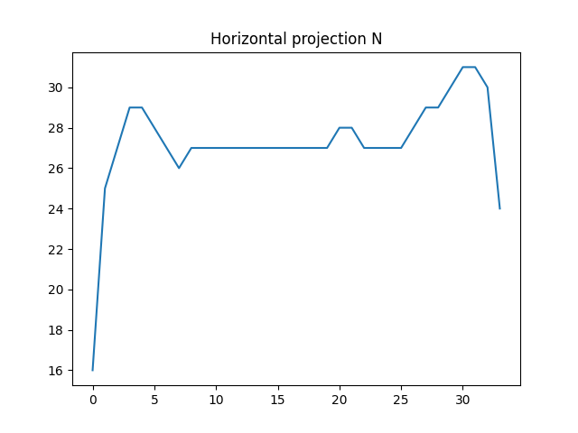  
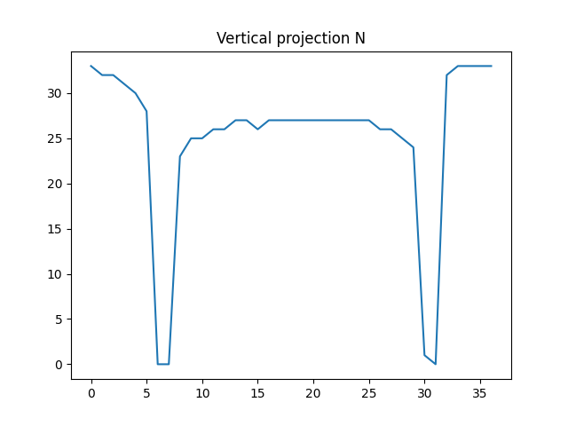  

## Буква Ξ
  
  
Вес черного - 665  
Удельный вес черного - 0.6519607843137255  
Координаты центра масс - (15, 16)  
Нормированные координаты центра масс - (0.4827586206896552, 0.45454545454545453)  
Центральный горизонтальный осевой момент - 42465  
Центральный вертикальный осевой момент - 52536  
Нормированный центральный горизонтальный осевой момент -20.654182879377434  
Нормированный центральный вертикальный осевой момент -25.55252918287938  
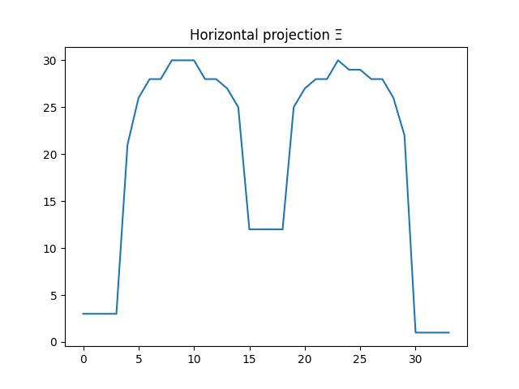  
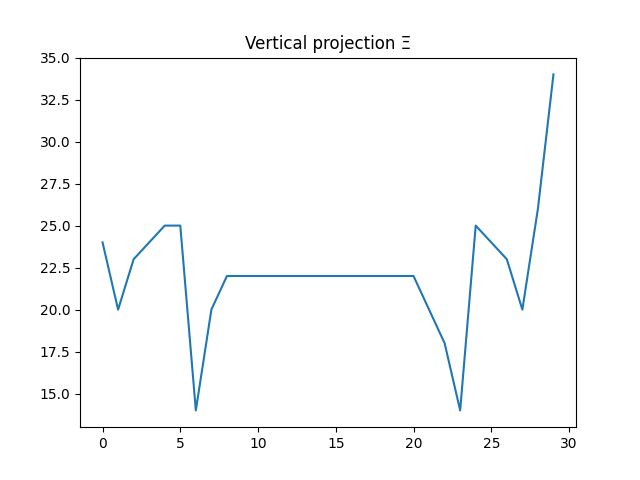  

## Буква Ο
  
  
Вес черного - 843  
Удельный вес черного - 0.7084033613445379  
Координаты центра масс - (17, 17)  
Нормированные координаты центра масс - (0.47058823529411764, 0.48484848484848486)  
Центральный горизонтальный осевой момент - 82630  
Центральный вертикальный осевой момент - 75642  
Нормированный центральный горизонтальный осевой момент -34.703905921881564  
Нормированный центральный вертикальный осевой момент -31.7690046199076  
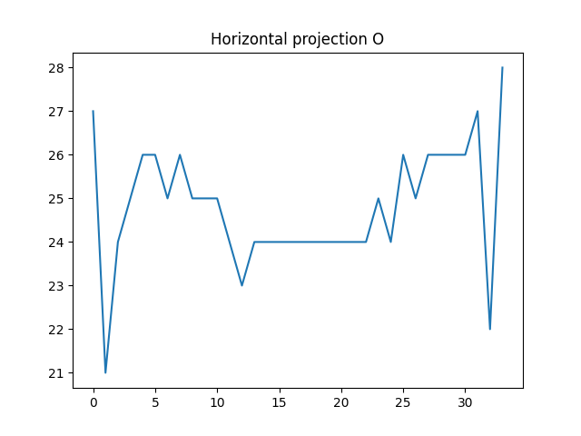  
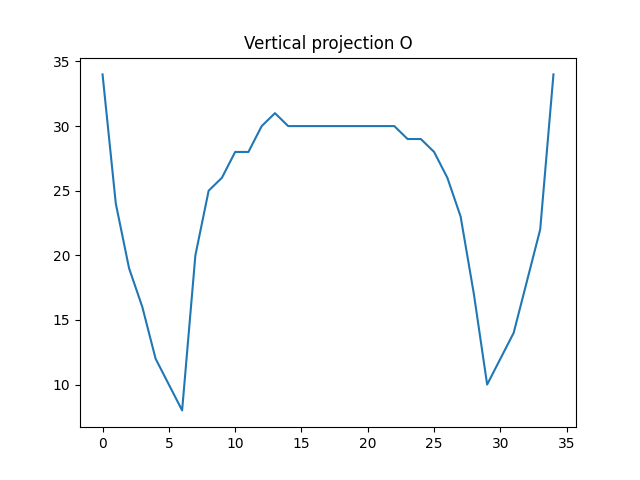  

## Буква Π
  
  
Вес черного - 844  
Удельный вес черного - 0.670906200317965  
Координаты центра масс - (18, 17)  
Нормированные координаты центра масс - (0.4722222222222222, 0.48484848484848486)  
Центральный горизонтальный осевой момент - 69122  
Центральный вертикальный осевой момент - 97613  
Нормированный центральный горизонтальный осевой момент -27.375049504950496  
Нормированный центральный вертикальный осевой момент -38.65861386138614  
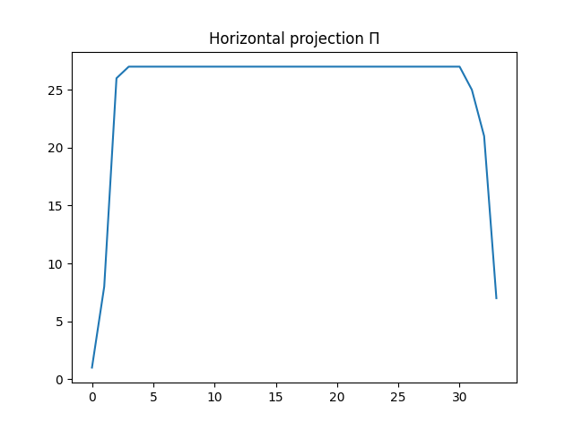  
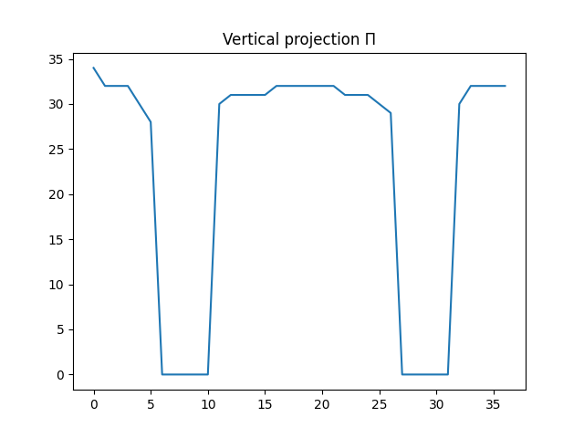  

## Буква Ρ
  
  
Вес черного - 635  
Удельный вес черного - 0.667016806722689  
Координаты центра масс - (14, 18)  
Нормированные координаты центра масс - (0.48148148148148145, 0.5151515151515151)  
Центральный горизонтальный осевой момент - 57502  
Центральный вертикальный осевой момент - 47062  
Нормированный центральный горизонтальный осевой момент -29.64020618556701  
Нормированный центральный вертикальный осевой момент -24.25876288659794  
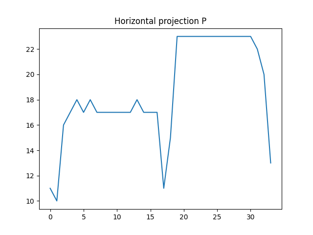  
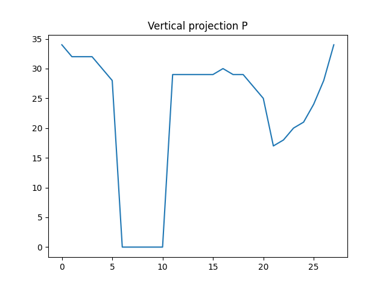  

## Буква Σ
  
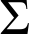  
Вес черного - 666  
Удельный вес черного - 0.6754563894523327  
Координаты центра масс - (14, 16)  
Нормированные координаты центра масс - (0.4642857142857143, 0.45454545454545453)  
Центральный горизонтальный осевой момент - 42902  
Центральный вертикальный осевой момент - 52481  
Нормированный центральный горизонтальный осевой момент -21.483224837255882  
Нормированный центральный вертикальный осевой момент -26.27991987981973  
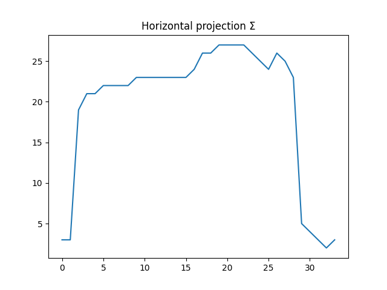  
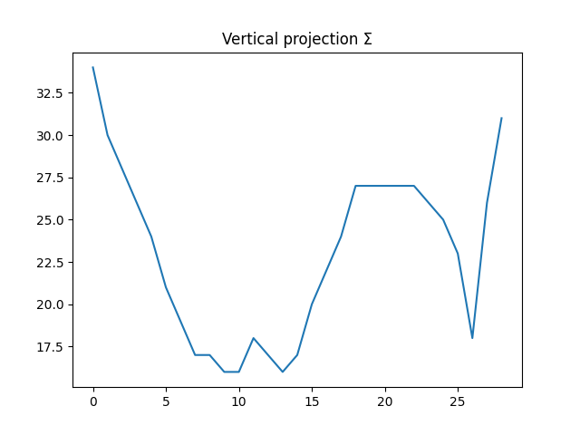  

## Буква Τ
  
  
Вес черного - 797  
Удельный вес черного - 0.7813725490196078  
Координаты центра масс - (15, 17)  
Нормированные координаты центра масс - (0.4827586206896552, 0.48484848484848486)  
Центральный горизонтальный осевой момент - 64090  
Центральный вертикальный осевой момент - 69070  
Нормированный центральный горизонтальный осевой момент -31.17217898832685  
Нормированный центральный вертикальный осевой момент -33.5943579766537  
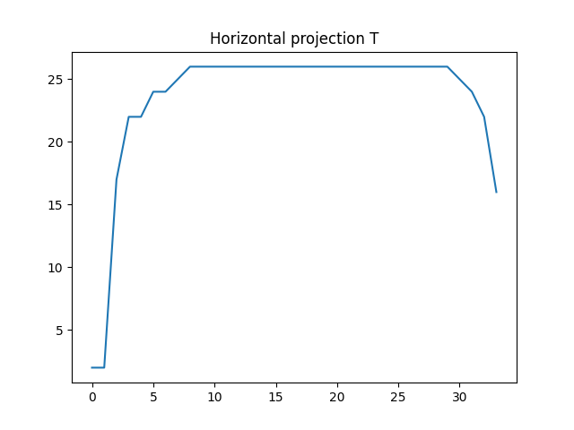  
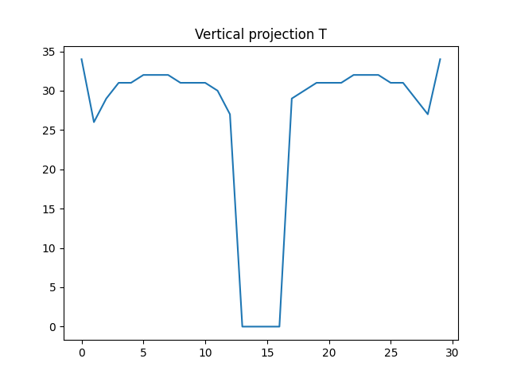  

## Буква Υ
  
  
Вес черного - 994  
Удельный вес черного - 0.7901430842607313  
Координаты центра масс - (18, 17)  
Нормированные координаты центра масс - (0.4722222222222222, 0.48484848484848486)  
Центральный горизонтальный осевой момент - 88246  
Центральный вертикальный осевой момент - 129445  
Нормированный центральный горизонтальный осевой момент -34.948910891089106  
Нормированный центральный вертикальный осевой момент -51.26534653465347  
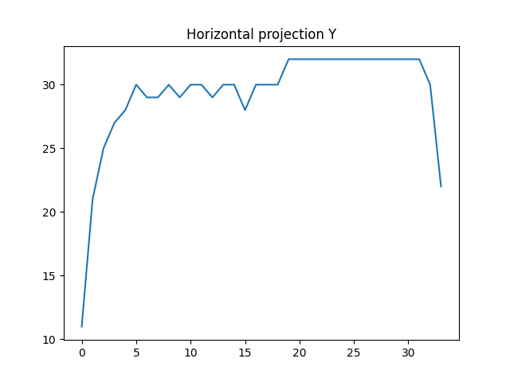  
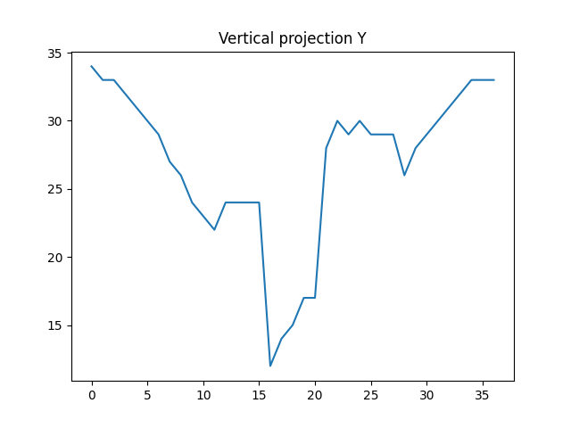  

## Буква Φ
  
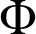  
Вес черного - 813  
Удельный вес черного - 0.6642156862745098  
Координаты центра масс - (17, 16)  
Нормированные координаты центра масс - (0.45714285714285713, 0.45454545454545453)  
Центральный горизонтальный осевой момент - 84378  
Центральный вертикальный осевой момент - 96824  
Нормированный центральный горизонтальный осевой момент -34.41190864600326  
Нормированный центральный вертикальный осевой момент -39.48776508972268  
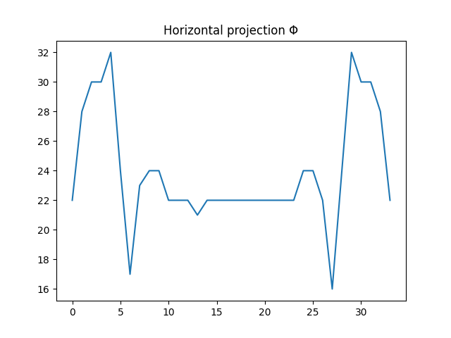  
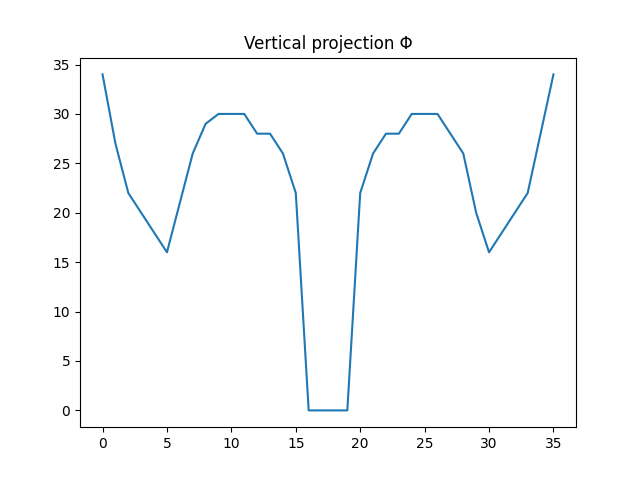  

## Буква Χ
  
  
Вес черного - 931  
Удельный вес черного - 0.7400635930047694  
Координаты центра масс - (18, 17)  
Нормированные координаты центра масс - (0.4722222222222222, 0.48484848484848486)  
Центральный горизонтальный осевой момент - 78610  
Центральный вертикальный осевой момент - 120442  
Нормированный центральный горизонтальный осевой момент -31.132673267326734  
Нормированный центральный вертикальный осевой момент -47.69980198019802  
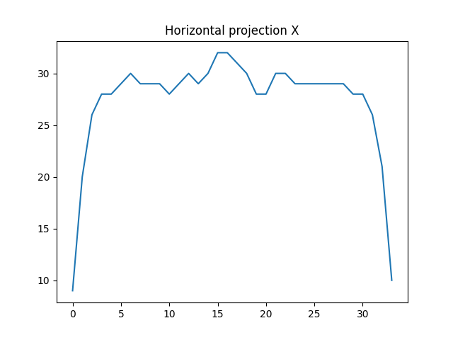  
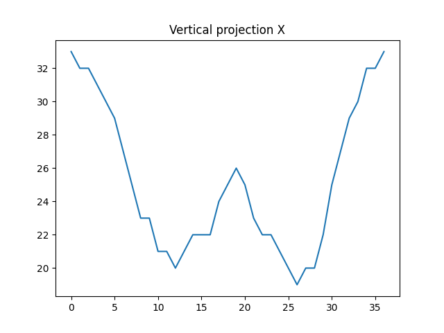  

## Буква Ψ
  
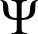  
Вес черного - 907  
Удельный вес черного - 0.7020123839009288  
Координаты центра масс - (18, 18)  
Нормированные координаты центра масс - (0.4594594594594595, 0.5151515151515151)  
Центральный горизонтальный осевой момент - 85952  
Центральный вертикальный осевой момент - 125049  
Нормированный центральный горизонтальный осевой момент -33.058461538461536  
Нормированный центральный вертикальный осевой момент -48.09576923076923  
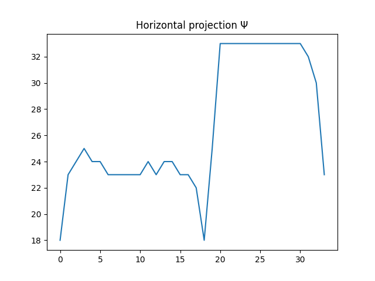  
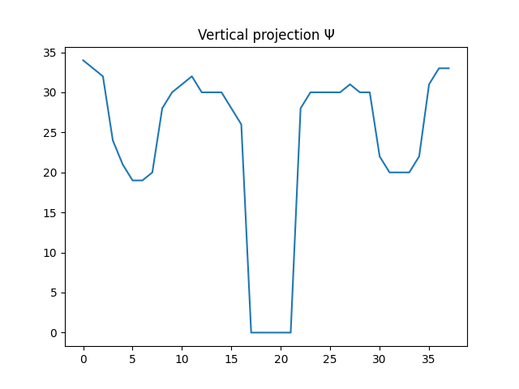  

## Буква Ω
  
  
Вес черного - 816  
Удельный вес черного - 0.6486486486486487  
Координаты центра масс - (18, 15)  
Нормированные координаты центра масс - (0.4722222222222222, 0.42424242424242425)  
Центральный горизонтальный осевой момент - 67567  
Центральный вертикальный осевой момент - 85273  
Нормированный центральный горизонтальный осевой момент -26.75920792079208  
Нормированный центральный вертикальный осевой момент -33.77148514851485  
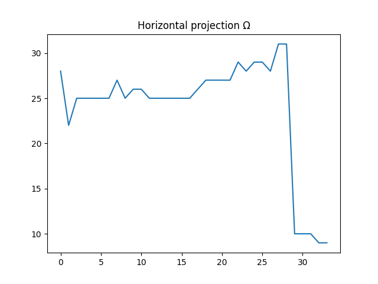  
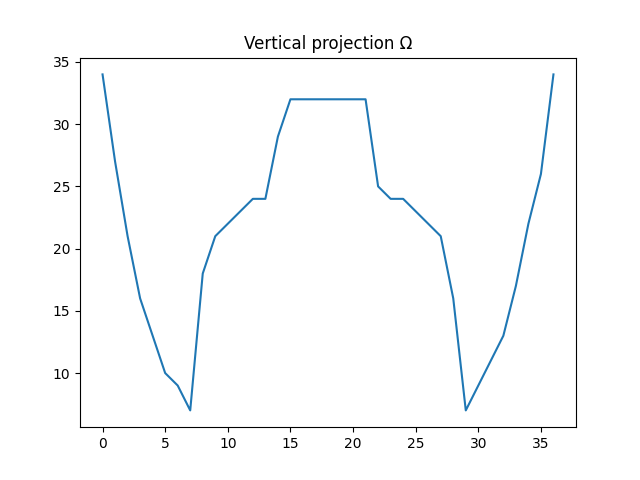  
