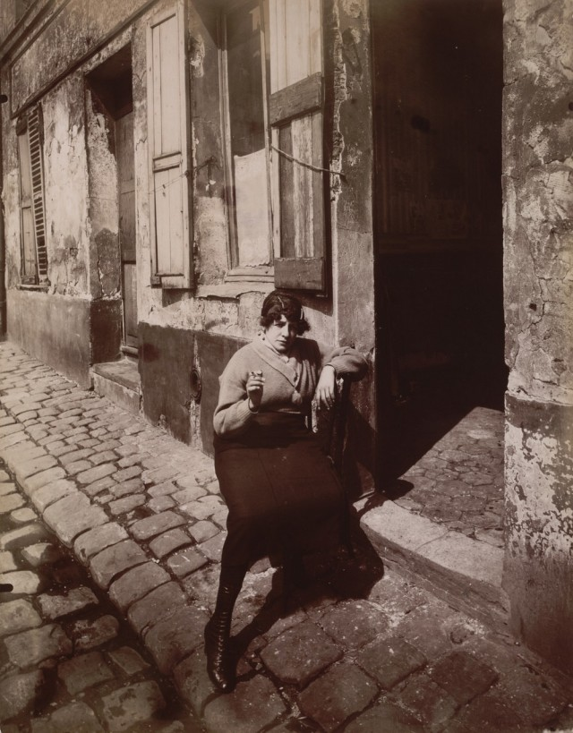
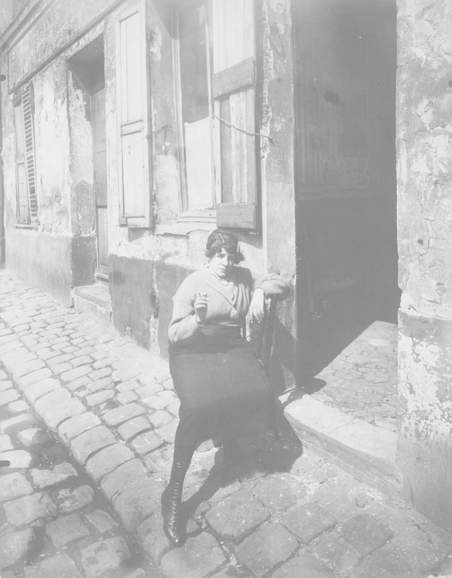

# Контрастирование
  
Выполнил Ахманов Алексей Б18-514
## old_paris.jpg

### Исходная картинка
  

### Оттенки серого
  

### Линейное контрастирование
  

### Степенное преобразование

#### Gamma = 0.25
  

#### Gamma = 0.5
  

#### Gamma = 0.75
  

#### Gamma = 1.0
  

#### Gamma = 1.25
  

#### Gamma = 1.5
  

#### Gamma = 1.75
  

#### Gamma = 2.0
  

## old_saratov.jpg

### Исходная картинка
  

### Оттенки серого
  

### Линейное контрастирование
  

### Степенное преобразование

#### Gamma = 0.25
  

#### Gamma = 0.5
  

#### Gamma = 0.75
  

#### Gamma = 1.0
  

#### Gamma = 1.25
  

#### Gamma = 1.5
  

#### Gamma = 1.75
  

#### Gamma = 2.0
  

## old_serpukhov.jpg

### Исходная картинка
  

### Оттенки серого
  

### Линейное контрастирование
  

### Степенное преобразование

#### Gamma = 0.25
  

#### Gamma = 0.5
  

#### Gamma = 0.75
  

#### Gamma = 1.0
  

#### Gamma = 1.25
  

#### Gamma = 1.5
  

#### Gamma = 1.75
  

#### Gamma = 2.0
  
