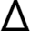
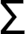
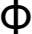
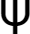
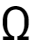

# Лабораторная работа 4. Выделение признаков символов

## Буква A
  
  
Вес черного - 758  
Удельный вес черного - 0.7191650853889943  
Координаты центра масс - (15, 16)  
Нормированные координаты центра масс - (0.4666666666666667, 0.45454545454545453)  
Центральный горизонтальный осевой момент - 76807  
Центральный вертикальный осевой момент - 69152  
Нормированный центральный горизонтальный осевой момент - 36.281058101086444  
Нормированный центральный вертикальный осевой момент - 32.66509211147851  

## Буква Β
  
  
Вес черного - 535  
Удельный вес черного - 0.6052036199095022  
Координаты центра масс - (13, 16)  
Нормированные координаты центра масс - (0.48, 0.45454545454545453)  
Центральный горизонтальный осевой момент - 45488  
Центральный вертикальный осевой момент - 30269  
Нормированный центральный горизонтальный осевой момент - 24.829694323144103  
Нормированный центральный вертикальный осевой момент - 16.522379912663755  

## Буква Γ
  
  
Вес черного - 628  
Удельный вес черного - 0.80306905370844  
Координаты центра масс - (12, 18)  
Нормированные координаты центра масс - (0.5, 0.5151515151515151)  
Центральный горизонтальный осевой момент - 51982  
Центральный вертикальный осевой момент - 25536  
Нормированный центральный горизонтальный осевой момент - 30.84985163204748  
Нормированный центральный вертикальный осевой момент - 15.154896142433234  

## Буква Δ
  
  
Вес черного - 803  
Удельный вес черного - 0.7156862745098039  
Координаты центра масс - (16, 15)  
Нормированные координаты центра масс - (0.46875, 0.42424242424242425)  
Центральный горизонтальный осевой момент - 67013  
Центральный вертикальный осевой момент - 82187  
Нормированный центральный горизонтальный осевой момент - 29.84988864142539  
Нормированный центральный вертикальный осевой момент - 36.60890868596882  

## Буква Ε
  
  
Вес черного - 589  
Удельный вес черного - 0.6929411764705883  
Координаты центра масс - (13, 17)  
Нормированные координаты центра масс - (0.5, 0.48484848484848486)  
Центральный горизонтальный осевой момент - 45690  
Центральный вертикальный осевой момент - 30624  
Нормированный центральный горизонтальный осевой момент - 25.654126895002808  
Нормированный центральный вертикальный осевой момент - 17.194834362717575  

## Буква Ζ
  
  
Вес черного - 593  
Удельный вес черного - 0.6976470588235294  
Координаты центра масс - (12, 16)  
Нормированные координаты центра масс - (0.4583333333333333, 0.45454545454545453)  
Центральный горизонтальный осевой момент - 41116  
Центральный вертикальный осевой момент - 34506  
Нормированный центральный горизонтальный осевой момент - 23.08590679393599  
Нормированный центральный вертикальный осевой момент - 19.374508702975856  

## Буква Η
  
  
Вес черного - 658  
Удельный вес черного - 0.6911764705882353  
Координаты центра масс - (13, 17)  
Нормированные координаты центра масс - (0.4444444444444444, 0.48484848484848486)  
Центральный горизонтальный осевой момент - 68809  
Центральный вертикальный осевой момент - 32320  
Нормированный центральный горизонтальный осевой момент - 35.46855670103093  
Нормированный центральный вертикальный осевой момент - 16.65979381443299  

## Буква Θ
  
  
Вес черного - 628  
Удельный вес черного - 0.6369168356997972  
Координаты центра масс - (14, 17)  
Нормированные координаты центра масс - (0.4642857142857143, 0.48484848484848486)  
Центральный горизонтальный осевой момент - 59111  
Центральный вертикальный осевой момент - 42705  
Нормированный центральный горизонтальный осевой момент - 29.599899849774662  
Нормированный центральный вертикальный осевой момент - 21.384576865297948  

## Буква Ι
  
  
Вес черного - 68  
Удельный вес черного - 0.3333333333333333  
Координаты центра масс - (2, 16)  
Нормированные координаты центра масс - (0.2, 0.45454545454545453)  
Центральный горизонтальный осевой момент - 6562  
Центральный вертикальный осевой момент - 442  
Нормированный центральный горизонтальный осевой момент - 5.50503355704698  
Нормированный центральный вертикальный осевой момент - 0.37080536912751677  

## Буква Κ
  
  
Вес черного - 647  
Удельный вес черного - 0.7047930283224401  
Координаты центра масс - (14, 16)  
Нормированные координаты центра масс - (0.5, 0.45454545454545453)  
Центральный горизонтальный осевой момент - 63722  
Центральный вертикальный осевой момент - 39046  
Нормированный центральный горизонтальный осевой момент - 33.80477453580902  
Нормированный центральный вертикальный осевой момент - 20.714058355437665  

## Буква Λ
  
  
Вес черного - 805  
Удельный вес черного - 0.7637571157495257  
Координаты центра масс - (15, 16)  
Нормированные координаты центра масс - (0.4666666666666667, 0.45454545454545453)  
Центральный горизонтальный осевой момент - 78889  
Центральный вертикальный осевой момент - 71084  
Нормированный центральный горизонтальный осевой момент - 37.26452527161077  
Нормированный центральный вертикальный осевой момент - 33.577704298535664  

## Буква Μ
  
  
Вес черного - 765  
Удельный вес черного - 0.625  
Координаты центра масс - (17, 17)  
Нормированные координаты центра масс - (0.45714285714285713, 0.48484848484848486)  
Центральный горизонтальный осевой момент - 76761  
Центральный вертикальный осевой момент - 67050  
Нормированный центральный горизонтальный осевой момент - 31.30546492659054  
Нормированный центральный вертикальный осевой момент - 27.345024469820554  

## Буква Ν
  
  
Вес черного - 596  
Удельный вес черного - 0.6260504201680672  
Координаты центра масс - (13, 17)  
Нормированные координаты центра масс - (0.4444444444444444, 0.48484848484848486)  
Центральный горизонтальный осевой момент - 60242  
Центральный вертикальный осевой момент - 30602  
Нормированный центральный горизонтальный осевой момент - 31.05257731958763  
Нормированный центральный вертикальный осевой момент - 15.774226804123712  

## Буква Ξ
  
  
Вес черного - 111  
Удельный вес черного - 0.3854166666666667  
Координаты центра масс - (12, 6)  
Нормированные координаты центра масс - (0.4782608695652174, 0.45454545454545453)  
Центральный горизонтальный осевой момент - 752  
Центральный вертикальный осевой момент - 7851  
Нормированный центральный горизонтальный осевой момент - 1.0444444444444445  
Нормированный центральный вертикальный осевой момент - 10.904166666666667  

## Буква Ο
  
  
Вес черного - 661  
Удельный вес черного - 0.6703853955375254  
Координаты центра масс - (14, 16)  
Нормированные координаты центра масс - (0.4642857142857143, 0.45454545454545453)  
Центральный горизонтальный осевой момент - 59155  
Центральный вертикальный осевой момент - 43035  
Нормированный центральный горизонтальный осевой момент - 29.621932899349023  
Нормированный центральный вертикальный осевой момент - 21.54982473710566  

## Буква Π
  
  
Вес черного - 658  
Удельный вес черного - 0.6911764705882353  
Координаты центра масс - (13, 18)  
Нормированные координаты центра масс - (0.4444444444444444, 0.5151515151515151)  
Центральный горизонтальный осевой момент - 54237  
Центральный вертикальный осевой момент - 32320  
Нормированный центральный горизонтальный осевой момент - 27.957216494845362  
Нормированный центральный вертикальный осевой момент - 16.65979381443299  

## Буква Ρ
  
  
Вес черного - 659  
Удельный вес черного - 0.7178649237472767  
Координаты центра масс - (14, 18)  
Нормированные координаты центра масс - (0.5, 0.5151515151515151)  
Центральный горизонтальный осевой момент - 61210  
Центральный вертикальный осевой момент - 38108  
Нормированный центральный горизонтальный осевой момент - 32.47214854111406  
Нормированный центральный вертикальный осевой момент - 20.216445623342175  

## Буква Σ
  
  
Вес черного - 589  
Удельный вес черного - 0.6929411764705883  
Координаты центра масс - (13, 16)  
Нормированные координаты центра масс - (0.5, 0.45454545454545453)  
Центральный горизонтальный осевой момент - 40930  
Центральный вертикальный осевой момент - 34628  
Нормированный центральный горизонтальный осевой момент - 22.981471083660864  
Нормированный центральный вертикальный осевой момент - 19.443009545199327  

## Буква Τ
  
  
Вес черного - 750  
Удельный вес черного - 0.7878151260504201  
Координаты центра масс - (14, 18)  
Нормированные координаты центра масс - (0.48148148148148145, 0.5151515151515151)  
Центральный горизонтальный осевой момент - 61258  
Центральный вертикальный осевой момент - 57763  
Нормированный центральный горизонтальный осевой момент - 31.576288659793814  
Нормированный центральный вертикальный осевой момент - 29.774742268041237  

## Буква Υ
  
  
Вес черного - 771  
Удельный вес черного - 0.781947261663286  
Координаты центра масс - (14, 18)  
Нормированные координаты центра масс - (0.4642857142857143, 0.5151515151515151)  
Центральный горизонтальный осевой момент - 74908  
Центральный вертикальный осевой момент - 60250  
Нормированный центральный горизонтальный осевой момент - 37.51026539809715  
Нормированный центральный вертикальный осевой момент - 30.17025538307461  

## Буква Φ
  
  
Вес черного - 716  
Удельный вес черного - 0.6580882352941176  
Координаты центра масс - (16, 16)  
Нормированные координаты центра масс - (0.4838709677419355, 0.45454545454545453)  
Центральный горизонтальный осевой момент - 78986  
Центральный вертикальный осевой момент - 71214  
Нормированный центральный горизонтальный осевой момент - 36.23211009174312  
Нормированный центральный вертикальный осевой момент - 32.66697247706422  

## Буква Χ
  
  
Вес черного - 693  
Удельный вес черного - 0.7028397565922921  
Координаты центра масс - (14, 17)  
Нормированные координаты центра масс - (0.4642857142857143, 0.48484848484848486)  
Центральный горизонтальный осевой момент - 64820  
Центральный вертикальный осевой момент - 55871  
Нормированный центральный горизонтальный осевой момент - 32.45868803204807  
Нормированный центральный вертикальный осевой момент - 27.97746619929895  

## Буква Ψ
  
  
Вес черного - 656  
Удельный вес черного - 0.6431372549019608  
Координаты центра масс - (14, 18)  
Нормированные координаты центра масс - (0.4482758620689655, 0.5151515151515151)  
Центральный горизонтальный осевой момент - 68891  
Центральный вертикальный осевой момент - 50548  
Нормированный центральный горизонтальный осевой момент - 33.50729571984436  
Нормированный центральный вертикальный осевой момент - 24.585603112840467  

## Буква Ω
  
  
Вес черного - 634  
Удельный вес черного - 0.6659663865546218  
Координаты центра масс - (14, 16)  
Нормированные координаты центра масс - (0.48148148148148145, 0.45454545454545453)  
Центральный горизонтальный осевой момент - 52483  
Центральный вертикальный осевой момент - 38490  
Нормированный центральный горизонтальный осевой момент - 27.053092783505154  
Нормированный центральный вертикальный осевой момент - 19.84020618556701  
